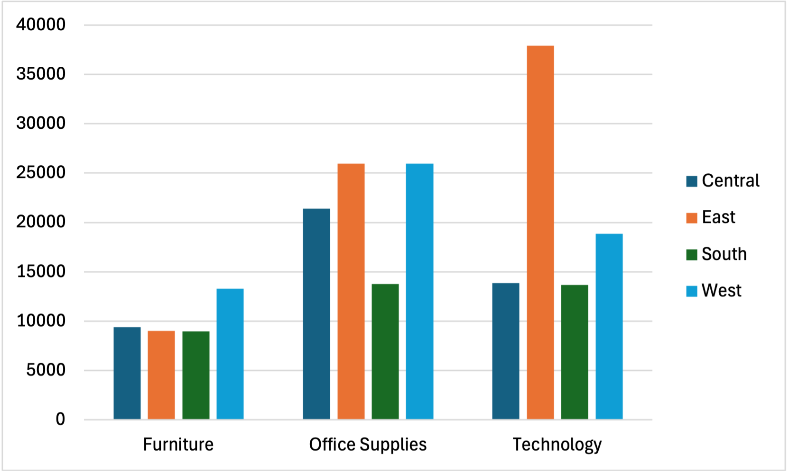
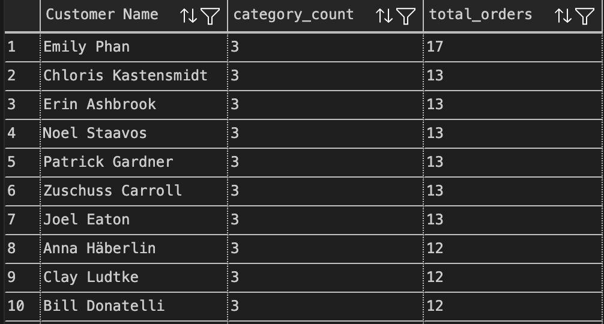
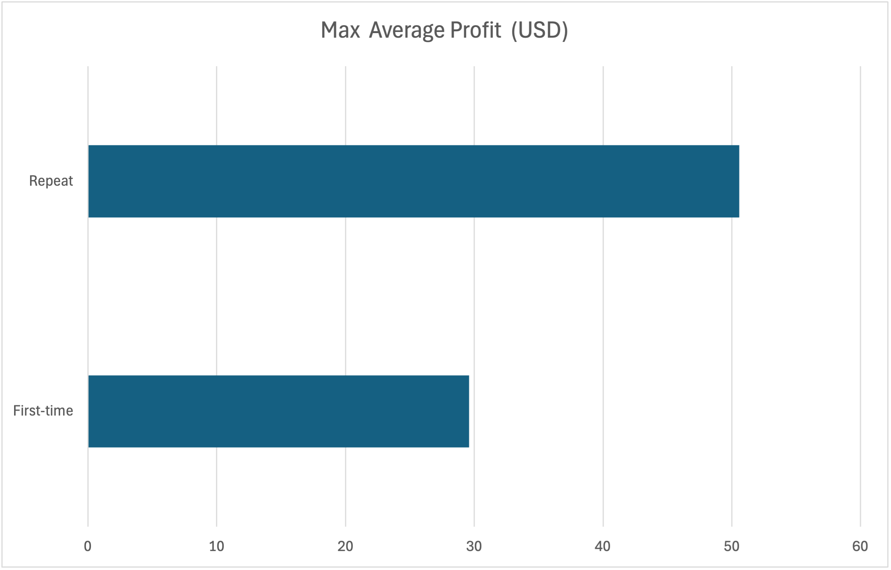
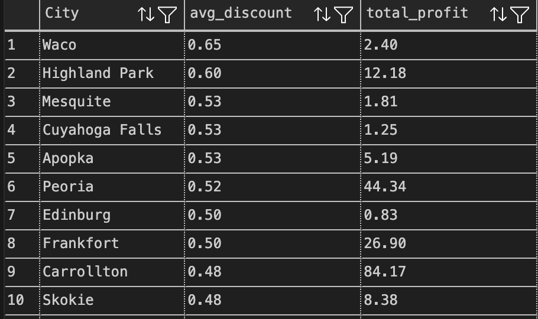
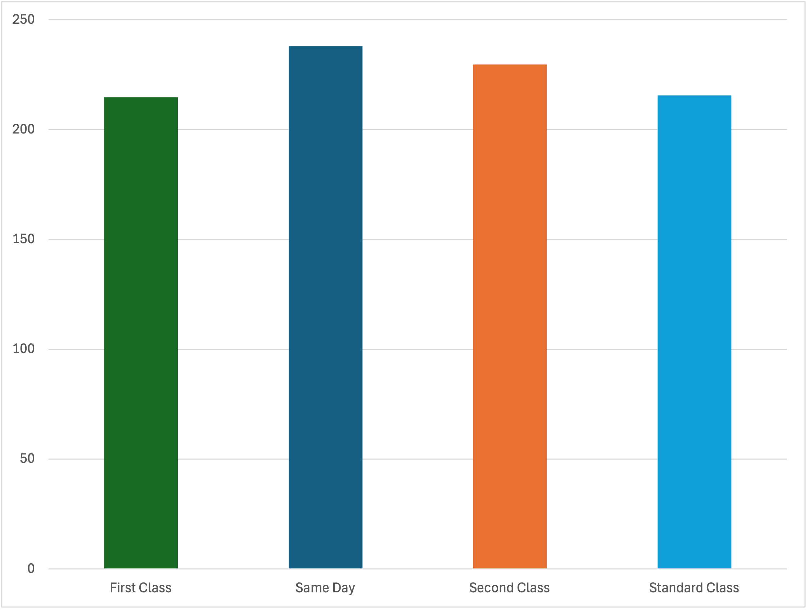

# Superstore Sales Analysis (SQL + Python)

This project analyzes Global Superstore retail data using **SQL (PostgreSQL)** and **Python**.

> 🚀 Tools: PostgreSQL · SQL · Python · Pandas · Seaborn · VS Code

---
## 📁 Project Structure

- `data/` → Contains the raw CSV file
- `scripts/` → Python & SQL files
  - `load_to_db.py` → Loads data into PostgreSQL
  - `data_cleaning.sql` → Cleans the dataset
  - `business_insights.sql` → Insight-generating SQL
  - `visualization1.py` → Generates charts
- `visuals/` → Output images and charts
- `notebooks/` → Optional Jupyter notebooks
- `cleaning_log.md` → Cleaning steps documentation
- `requirements.txt` → Python dependencies
- `README.md` → Project documentation

---

## 📊 Project Objectives

- Clean raw sales data using SQL
- Extract actionable insights through SQL queries
- Visualize insights using Excel
- Summarize findings with business relevance

---

## 🧹 Data Cleaning Summary

- Verified nulls, standardized casing in columns
- Checked for duplicate orders and invalid dates
- Cleaned discount and profit anomalies
- Logged all cleaning steps in [`cleaning_log.md`](cleaning_log.md)

---

## 💼 Key Business Insights & Visuals

### 1. Are certian product categories are more profitable in specific regions? 

---

### 2. Which customers frequently buy from more than one category?

---

### 3. 🔁 First-Time vs Repeat Customers (Profit Comparison) 
*Do repeat customers bring higher profit?*

---

### 4. ⚠️ Cities with High Discounts but Low Profits  
*Where are we giving too much discount but getting low returns?*

---

### 5. 🚚 Profit vs Sales by Shipping Mode
*How does shipping mode affect order performance?*

---

## 📌 How to Run the Project

1. Clone the repo  
   `git clone https://github.com/darshanr-c/sql_superstore_analysis.git`

2. Activate the virtual environment  
   `source .venv/bin/activate`

3. Install Python dependencies  
   `pip install -r requirements.txt`

4. Load data into PostgreSQL  
   `python scripts/load_to_db.py`

5. Run cleaning & analysis  
   - SQL: `scripts/data_cleaning.sql` & `business_insights.sql`
   - Python: `scripts/visualization1.py`

---

## 🔍 Summary of Insights

| Business Area           | Insight Example                                                   |
|-------------------------|-------------------------------------------------------------------|
| Regional Performance    | Central & West regions are leading in profit                     |
| Customer Behavior       | Repeat customers guves higher avg. profit                        |
| Product Strategy        | Some high-selling products have less profitability               |
| Discount Optimization   | Certain cities have high discounts but low returns               |
| Logistics & Delivery    | Standard shipping is most used, but not always most profitable   |

---

## Author

**Darshan Chaudhari**  
Master’s in Data Science · Germany  
[LinkedIn →](https://www.linkedin.com/in/darshanr-c)

---
